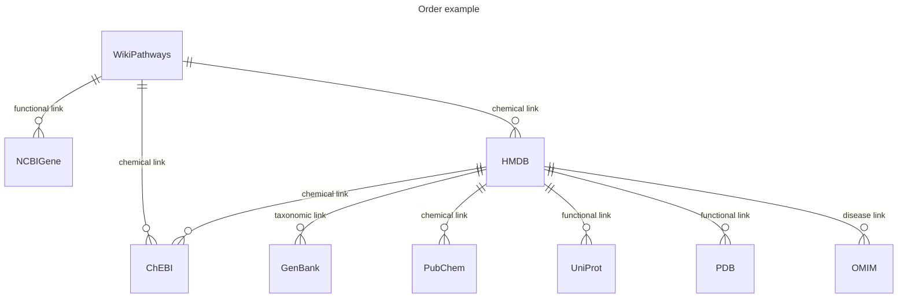

# Visualize the Reference Matrix
```bash
cd ./scripts/
python db_expansion.py

Rscript integrated_db_plotting.R
```
The `db_expansion.py` script generates the edge distance between a given database `i` and all child databases that it references. An example case for WikiPathways is given below.




