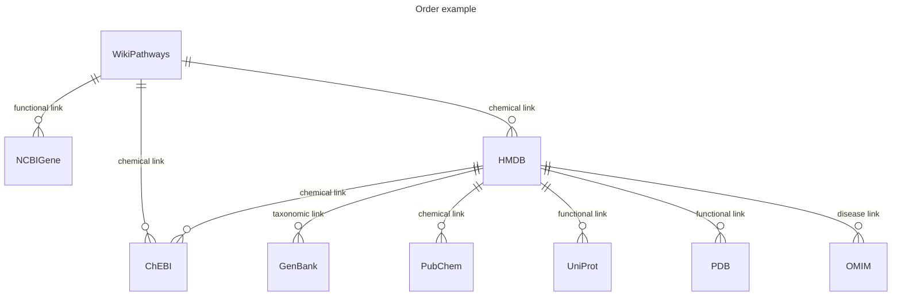
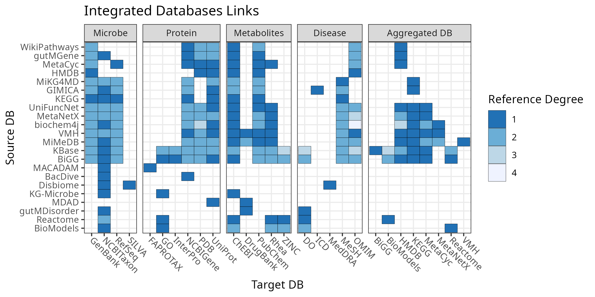

# Environment Installation
```bash
mamba env create -f db_review.yml
```

# Generate the Reference Matrix Visualization
```bash
snakemake --cores 1
```
## Child Database Expansion
The `db_expansion.py` script generates the edge distance between a given database `i` and all child databases that it references. An example case for WikiPathways is given below.



| Source DB    | Target DB | Edge Distance |
|--------------|-----------|---------------|
| WikiPathways | NCBIGene  | 1             |
| WikiPathways | ChEBI     | 1             |
| WikiPathways | HMDB      | 1             |
| WikiPathways | UniProt   | 2             |
| WikiPathways | PDB       | 2             |
| WikiPathways | OMIM      | 2             |
| WikiPathways | PubChem   | 2             |
| WikiPathways | GenBank   | 2             |

## Reference Matrix Visualization
We then use our expanded reference table to hierarchically cluster the Source Databases (plotted along the y-axis) based off edge distance to the child nodes.



