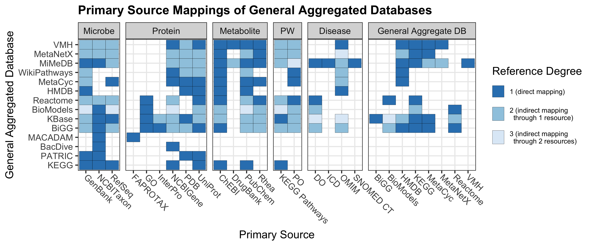

## Visualize the integrated resources relationships as network diagram

The following steps will create the output necessary to visualize the relationships among integrated resources and primary sources as a network diagram. In order to finish the figure, Cytoscape must be installed. Manual instructions to create the figure are included.

### Create network where size of primary sources and aggregated DBs represent number of integrated resources that use them as mappings

In Cytoscape:
1. Import network from file: Resource Interaction Table.xlsx, Sheet 1 (set as source, interaction, target)
2. Import table from file: Resource Interaction Table.xlsx, Sheet 2 (set as node, catergory)
3. Set node style, fill color, discrete mapping to unique colors for each category
5. Position integrated DB nodes in following order: mdad, gutmgene, gutmdisorder, disbiome, amadis, gimica, bugsigdb, dbbact, mikg4md, preprobiotickg, kg-microbe, biochem4j, unifuncnet
6. Remove labels of edges
7. Change label size to circle, inDegree, continuous mapping
    a. Go to tools, analyze network, analyze as directed graph to change node size
    b. Toggle with Continuous Mapping Editor for node size to make peak ~10 up to ~70-80
    c. Select integrated databases, set bypass for shape (rectangle) and size (15)
8. Only include edges between integrated DBs, aggregated DBs, and primary sources
    a. Select all integrated db nodes, select - edges - select all edges, then select - nodes - deselect all nodes to remove edges
    b. Select all aggregated db nodes, , select - edges - select all edges, then select - nodes - deselect all nodes to remove edges
9. Save figure as Network_sizeByDegree.svg

### Create network where size of primary sources and aggregated DBs represent number of integrated resources that use them as mappings

1. Run the following:
```
cd ./scripts/

python db_expansion.py
Rscript integrated_db_plotting.R
Rscript collapse_categories.R
```

In Cytoscape:
2. Import network from file: ~/data/category_edges.tsv, Sheet 1 (set as source, interaction, target)
3. Import table from file: Resource Interaction Table.xlsx, Sheet 2 (set as node, catergory)
4. Align integrated db’s in order above categories
    a. Select integrated db’s only, Layout Tools, align and distribute
5. Select all categories, set size to 100
6. Change line width to 1, ensure no arrowhead is there (arrowhead will be added in AdobeIllustrator)
7. Save as Network_categories.svg

### Create network with edges
In Adobe Illustrator:
1. Open Network_sizeByDegree.svg
2. Open Network_categories.svg
    a. Update colors to chosen palette
    b. For large category circles, make 50% opacity
    c. Rotate rectangle, text for integrated DB rectangles
3. Change arrowhead to shape to edit colors
    a. Add target arrowhead
    b. Select same, fill & stroke
    c. Object, path, outline stroke

## Visualize the Reference Matrix

The following code will create Figure 2b, the matrix of inegrated resource relationships.

### Environment Installation
```bash
mamba env create -f db_review.yml
```

### Generate the Reference Matrix Visualization
```bash
snakemake --cores 1
```
#### Child Database Expansion
The `db_expansion.py` script generates the edge distance between a given database `i` and all child databases that it references. An example case for WikiPathways is given below.

```mermaid
title: Order example
    WikiPathways ||--o{ "NCBIGene" : "functional link";
    WikiPathways ||--o{ "ChEBI" : "chemical link";
    WikiPathways ||--o{ "HMDB" : "chemical link";
    HMDB ||--o{ "GenBank" : "taxonomic link";
    HMDB ||--o{ "ChEBI" : "chemical link";
    HMDB ||--o{ "PubChem" : "chemical link";
    HMDB ||--o{ "UniProt" : "functional link";
    HMDB ||--o{ "PDB" : "functional link";
    HMDB ||--o{ "OMIM" : "disease link";
```

| Source DB    | Target DB | Edge Distance |
|--------------|-----------|---------------|
| WikiPathways | NCBIGene  | 1             |
| WikiPathways | ChEBI     | 1             |
| WikiPathways | HMDB      | 1             |
| WikiPathways | UniProt   | 2             |
| WikiPathways | PDB       | 2             |
| WikiPathways | OMIM      | 2             |
| WikiPathways | PubChem   | 2             |
| WikiPathways | GenBank   | 2             |

### Reference Matrix Visualization
We then use our expanded reference table to hierarchically cluster the Source Databases (plotted along the y-axis) based off edge distance to the child nodes.
This can be done with the Resource Interaction Table-withIntegrated.xlsx file to include all integrated database, or with the Resource Interaction Table.xlsx file for only aggregate databases (as shown here):

